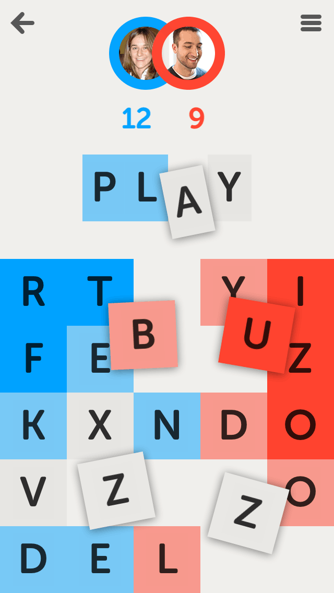

## About

This repo is inspired by the excellent iOS game: [LetterPress](http://www.letterpressapp.com/)

I sought out to recreate the UI in web-based technologies such as SVG, CSS, HTML and JavaScript, keeping the implementation as lean as possible.

## Development

To get the development server running, I'm using a barebones setup of Node and Python.

Node runs a series of development tools such as Stylelint, while Python is used to host a SimpleHTTPServer on the base directory.
